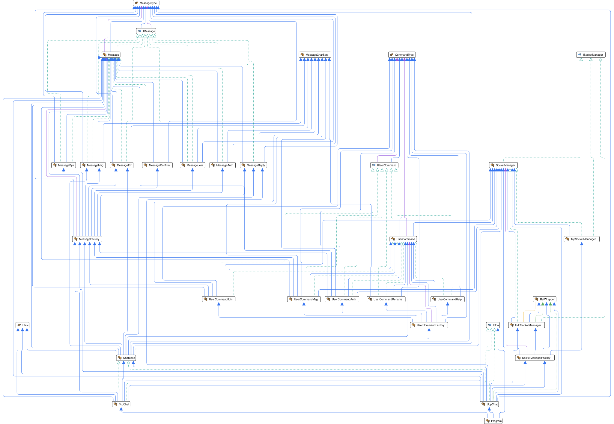
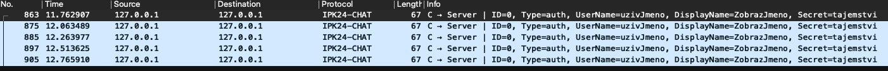
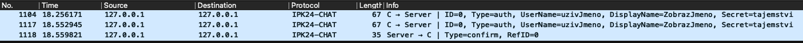
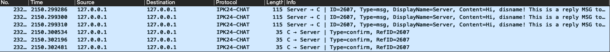
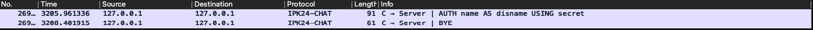
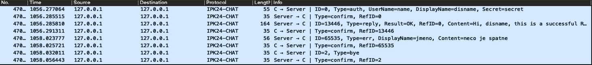
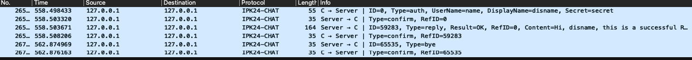

# Dokumentace IPK k prvnímu projektu

Varianta: Klient pro chatovací server

## Obsah

- [Dokumentace IPK k prvnímu projektu](#dokumentace-ipk-k-prvnímu-projektu)
  - [Obsah](#obsah)
  - [Úvod](#úvod)
    - [Funkce aplikace](#funkce-aplikace)
    - [Teorie](#teorie)
  - [Spuštění programu](#spuštění-programu)
  - [Implementace](#implementace)
    - [Zakladní struktura](#zakladní-struktura)
    - [Popis průběhu programu](#popis-průběhu-programu)
      - [Start a zpracování argumentů](#start-a-zpracování-argumentů)
      - [Spuštění klienta](#spuštění-klienta)
      - [Zpracování uživatelského vstupu](#zpracování-uživatelského-vstupu)
      - [Zpracování zpráv ze serveru](#zpracování-zpráv-ze-serveru)
      - [Ukončení programu](#ukončení-programu)
    - [Zajímavé časti kódu](#zajímavé-časti-kódu)
      - [Odesílání udp zpráv](#odesílání-udp-zpráv)
      - [Přijímání tcp zpráv](#přijímání-tcp-zpráv)
      - [Kódování a dekodování zpráv a uživatelských příkazů](#kódování-a-dekodování-zpráv-a-uživatelských-příkazů)
  - [Testování](#testování)
    - [Testovací prostředí](#testovací-prostředí)
    - [Aplikace použité k testování](#aplikace-použité-k-testování)
    - [Průběh testování](#průběh-testování)
      - [Testování správného kodování a dekodování zpráv](#testování-správného-kodování-a-dekodování-zpráv)
      - [Odesílání zpráv](#odesílání-zpráv)
      - [Přijímání zpráv](#přijímání-zpráv)
      - [Ostatní logika aplikace](#ostatní-logika-aplikace)
        - [Přijmutí duplicitní zprávy](#přijmutí-duplicitní-zprávy)
        - [Ukončení aplikace pomocí *SIGINT* signálu](#ukončení-aplikace-pomocí-sigint-signálu)
        - [Přijmutí zprávy obsahující některé nepodporované znaky](#přijmutí-zprávy-obsahující-některé-nepodporované-znaky)
        - [Přijmutí zprávy nepodporované aktuálním stavem](#přijmutí-zprávy-nepodporované-aktuálním-stavem)
        - [Správné ukončení aplikace při příjmutí err nebo bye zprávy](#správné-ukončení-aplikace-při-příjmutí-err-nebo-bye-zprávy)
  - [Bibliografie](#bibliografie)

## Úvod

### Funkce aplikace

Aplikace slouží jako klient pro chatovaní se vzdáleným serverem pomocí protokolu `IPK24-CHAT`. Přijímá data od uživatele na standardním vstupu, zpracovává je a případně odesílá na server. Data přijatá ze serveru také zpracovává a případně vypisuje na standardní nebo standardní chybový výstup. Aplikace může odesílat data pomocí TCP nebo UDP protokolu.

### Teorie

TCP protokol je textový protokol transportní vrstvy, který zajišťuje spolehlivý přenos dat. Proto na aplikační úrovni není třeba řešit příliš mnoho. Jediný problém, který může nastat, je spojení více zpráv při jednom čtení nebo rozdělení zprávy do více samostatných čtení. TCP se totiž na aplikační úrovni tváří, že posílá data jako souvislý proud bajtů[1]. Pro ošetření těchto stavů obsahuje protokol `IPK24-CHAT` v gramatice pro TCP na konci každé zprávy ukončující sekvenci pro jednoznačnou identifikaci konce zprávy. Konkrétně používá `\r\n`, tedy ukončení řádku na operačním systému Windows.

UDP protokol transportní vrstvy oproti tomu nezajišťuje žádný spolehlivý přenos. Data se jednoduše odešlou a dál není nic garantováno[2]. Proto je potřeba větší zásah na aplikační úrovni. V protokolu `IPK24-CHAT` je pro zajištění správné komunikace používán speciální typ zprávy `CONFIRM` pro potvrzení nějaké přijaté zprávy. Toto potvrzení nese ID zprávy, kterou potvrzuje, a zajišťuje informaci, že odeslaná zpráva byla doručena. Pokud zpráva není do určitého času potvrzena, odesílá se znova, dokud není doručena nebo nevyprší maximální počet odeslání. Oproti TCP ovšem z definice `IPK24-CHAT` protokolu vychází z toho, že v každém datagramu bude jedna zpráva, a proto není potřeba řešit problém rozdělení nebo spojení, jako je tomu u TCP.

## Spuštění programu

Program je potřeba nejdříve přeložit pomocí příkazu `make`. Po přeložení programu ho lze spustit pomocí `./ipk24chat-client` s povinnými argumenty `-s {adresa serveru}` a `-t [tcp/udp]`. Adresu lze zadat ve dvou formátech: buď jako klasickou IP adresu s dekadickými čísly, nebo jako název domény (například 127.0.0.1 nebo server.domena.cz).
Další argumenty slouží pro podrobnější nastavení komunikace nebo pro vypsání nápovědy k programu.

## Implementace

### Zakladní struktura

Struktura aplikace je rozdělena do několika základních tříd a poté do tříd pro každou zprávu a uživatelský příkaz (vstup), o jejichž vytváření se starají třídy `MessageFactory` a `UserCommandFactory`. Základními třídami, které zajišťují hlavní část funkcionality, jsou poté `ChatBase`, `UdpChat`, `TcpChat` a `SocketManager`. Tyto třídy se starají o odesílání a přijímání zpráv, přijímání uživatelského vstupu, stavovou logiku aplikace a ukončování aplikace z různých důvodů (Ctrl+C, `bye` zpráva, chyby atp.).

Detaily struktury lze vidět v následujícím vygenerovaném UML diagramu tříd:

### Popis průběhu programu

#### Start a zpracování argumentů 

Celý program začíná v třídě `main` zpracováním vstupních argumentů pomocí System.CommandLine.DragonFruit[3]. Následně se na základě argumentem určeného protokolu transportní vrstvy vytvoří instance třídy `UdpChat` respektive `TcpChat`. Poté se nastaví reakce na signál SIGINT, která spustí metodu `HandleSigintEnd` nad vytvořenou instancí. Následně je nad instancí zavolána metoda `StartClient`, která spustí chat pro UDP respektive TCP.

#### Spuštění klienta

V metodě `StartClient` je vytvořena instance třídy `UdpSocketManager`, která využívá instanci UdpClient[4], respektive `TcpSocketManager`, která využívá instanci TcpClient[5], pomocí `SocketManagerFactory`. Poté jsou vytvořeny 4 paralelní Tasky, z nichž každý zajistí paralelní běh metod `ReadStdInput`, `ProcessUserInput`, `ReceiveServerMessages` a `ProcessServerMessages`. Metody `ProcessUserInput` a `ProcessServerMessages` spolu poté komunikují pro zajištění správného běhu aplikace pomocí instanční proměnné označující stav aplikace a zasílání signálů pomocí AutoResetEvent[6].

#### Zpracování uživatelského vstupu

Metoda `ReadStdInput` zajišťuje čtení uživatelského vstupu, který ukládá po načtených řadcích jako položky do BlockingCollection[7]. Tato kolekce je poté zpracovávána cyklem v metodě `ProcessUserInput`. Pro každou položku je nad `UserCommandFactory` zavolána metoda `CreateCommandFromUserInput`, která vytvoří instanci konkrétního příkazu nebo vyvolá výjimku `FormatException`. Poté je podle typu instrukce a aktuálního stavu zvolena akce. Pokud je uživatelský příkaz v aktuálním stavu povolen, je nad jeho instancí zavolána metoda `Execute`, která provede logiku této instrukce. V případě chyby může vyvolat výjimku typu `SocketException` nebo `TimeoutException`.

Pokud logika instrukce zahrnuje odesílání zprávy, je jí předána instance používaného `SocketManager`. V metodě `Execute` je poté pomocí `MessageFactory` vytvořena instance `Message` pro konkrétní zprávu. Nad touto zprávou je zavolána metoda `CodeMessage<TMessageDataType>`, která zařídí zakódování do formátu pro odeslání, který je určen pomocí `TMessageDataType`, a je provedeno odeslání pomocí metody `SendMessage` nad instancí `SocketManager`.

#### Zpracování zpráv ze serveru

Metoda `ReceiveServerMessages` zajišťuje přijímání zpráv od serveru a jednotlivé zprávy ukládá do BlockingCollection[7]. Tato kolekce je poté zpracovávána cyklem v metodě `ProcessServerMessages`. Pro každou zprávu v kolekci je nad `MessageFactory` zavolána metoda `CreateMessageFromCoded`, která ze zakódované zprávy vytvoří instanci zprávy. V případě špatného formátu přijaté zprávy je vyvolána výjimka `FormatException`. Pro UDP zprávu typu confirm a reply probíhá kontrola správného referenčního ID zprávy (zdali odpovídá nějaké dříve odeslané zprávě). Je také odesláno potvrzení na přijaté zprávy kromě zprávy typu confirm. Následně probíhá kontrola duplicity a poté již samotná logika zpracování zpráv, která probíhá ve funkci `ProcessServerMessage`. Logika je závislá na typu zprávy a na aktuálním stavu a je stejná pro TCP i UDP.

#### Ukončení programu

Pokud je vyvolán jakýkoliv požadavek na ukončení programu, vždy je nejprve provedeno ukončení čtení uživatelského vstupu. Dle typu požadavku může nebo nemusí být dále přerušeno zpracovávání tohoto vstupu a odeslána zpráva typu `err`. Zprávy určené k odeslání na konec komunikace (`err`, `bye`) jsou ukládány do samostatné kolekce. Odeslání zpráv z této kolekce probíhá po ukončení zpracovávání vstupu ve funkci `ProcessClientBuffer`. Po odeslání a potvrzení těchto zpráv je celý program ukončen s odpovídajícím návratovým kódem.

### Zajímavé časti kódu

#### Odesílání udp zpráv
U odesílání zpráv pomocí UDP bylo potřeba zajistit opětovné posílání v případě neobdržení potvrzení o přijetí. Toto je v programu zajištěno pomocí opětovného odesílání v rutině časovače.

Poprvé je zpráva odeslána mimo časovač a následně je časovač spuštěn. Časovač každých X milisekund, kde X značí dobu, po které má dojít k opětovnému odeslání a tato doba je nastavena v parametrech (v základu 250 ms), zavolá rutinu, ve které je provedeno opětovné odeslání a zvýšení počítadla, které značí počet odeslání. Před každým odesláním se provádí kontrola, zda již nebyl překročen maximální počet odeslání, a pokud ano, je časovač zastaven a odeslán signál, který informuje o vypršení maximálního počtu pokusů.
 
Na tento signál a další signál značící změnu potvrzených zpráv probíhá čekání. Pokud je aktivován signál označující dosažení maximálního počtu pokusů, je vyvolána výjimka `TimeoutException`. Pokud přijde signál o změně potvrzení, je pomocí ID zprávy zkontrolováno, zda byla potvrzena odesílaná zpráva. Pokud nebyla, je opět prováděno čekání, pokud byla, je časovač ukončen a odesílání je považováno za dokončené.

#### Přijímání tcp zpráv
U přijímání pomocí TCP může nastat problém, který byl již popsán výše v sekci **Teorie**. Tedy problém se spojením nebo rozdělením zpráv. Řešení tohoto problému je implementováno tím, že každá přijatá data jsou přidána do třídy StringBuilder[8]. Z této třídy je následně vygenerován řetězec a v něm je vyhledána pozice posledního výskytu podřetězce značícího konec zprávy. Řetězec od počátku po poslední ukončovací podřetězce je poté rozdělen do jednotlivých zpráv. Zbytek nedočtené zprávy je ponechán v StringBuilderu, a tedy další přijatá část zprávy se k tomuto zbytku přidá a proces se opakuje.

#### Kódování a dekodování zpráv a uživatelských příkazů
Kodování zpráv je implementováno v třídách jednotlivých zpráv. Pro UDP je použita funkce `Array.Copy`. Nejprve jsou části delší než 1 byte přeloženy do pole bytů (pokud se jedná o číslo, je převedeno do big endianu), a poté jsou části postupně nakopírovány do jednoho výsledného pole bytů.

Dekodování probíhá postupně tak, že se po 1 nebo 2 bytech berou čísla a převádějí se z bytů. Na řetězce je poté použita metoda `ExtractStringFromBytes`, která najde v poli bytů ukončení řetězce a nalezený řetězec vrátí.

Pro kódování TCP je použit interpolační řetězec. Pro jeho dekódování jsou použity regulární výrazy a data jsou extrahována pomocí skupin regulárních výrazů. Stejný princip se používá i pro dekódování uživatelského vstupu.

## Testování
### Testovací prostředí
Testování probíhalo na dvou zařízeních. Na referenčním virtuálním stroji s využitím referenčního prostředí pro programovací jazyk C#. Referenční prostředí bylo vybráno z dostupného repozitáře [`dev-envs`](https://git.fit.vutbr.cz/NESFIT/dev-envs). Tento referenční virtuální stroj byl spouštěn na zařízení s následujícími specifikacemi:

+ Operační systém: Windows 10
+ Procesor: Intel Core i5-4690
+ Zakladní deska: MSI Z97 GAMING 3 - Intel Z97
+ Grafická karta: MSI GTX 970 GAMING 4G

Specifikace dalšího testovacího zařízení, kde probíhalo testování nyní napřímo, bez referečního stroje:

+ Operační systém: macOS verze Sonoma 14.3.1
+ Procesor: Apple M1

### Aplikace použité k testování
Pro obecné testování byl použit Wireshark s dodaným rozšířením pro detekci paketů posílaných přes protokol `IPK24-CHAT`, a pro testování v závěru byl využit referenční server.

Pro oddělené testování UDP byl využit jednoduchý přijímač a odesílač napsaný v jazyce Python, a také výpis zpráv do konzole jako řetězec hexadecimálních znaků.

Pro tcp byl poté využit netcat s následujícími argumenty: `-4 -c -l -v 127.0.0.1 4567` kde:
+ `-4` značí použití pouze IPv4 adres
+ `-c` značí použití window ukončení řádku pro zprávy.
+ `-l` Spustí netcat v režimu naslouchání, čekající na příchozí spojení místo inicializace spojení.
+ `-v` Zapne verbose režim, který zobrazuje více informací o prováděných akcích.

### Průběh testování 
Většina testování probíhala lokálně. Pouze v závěru byla funkčnost kompletně ověřena vůči referenčnímu serveru za použití obou protokolů.

Protokol `IPK24-CHAT` definuje různé formáty zpráv pro TCP a UDP. Testování kódování a dekódování do těchto formátů bylo provedeno pro každý protokol zvlášť. Stejně tak části logiky, které obsahuje UDP oproti TCP navíc, byly testovány zvlášť.

Zbytek logiky aplikace je stejný pro oba protokoly, a proto většina této logiky byla testována pomocí Netcatu a TCP kvůli jednodušší práci s přijímáním a odesíláním.

#### Testování správného kodování a dekodování zpráv
U TCP i UDP bylo nejdříve ověřeno správné kódování zprávy vytvořením instance konkrétního typu zprávy a následným zavoláním metody pro zakódování. Poté byla pro kontrolu zakódovaná zpráva vypsána v podobě hexadecimálních znaků (pro TCP také jako klasický řetězec).

Následně byla provedena kontrola dekódování. Nejprve proběhlo vytvoření zprávy a její zakódování (které již bylo ověřeno), a poté byla vytvořena nová zpráva pomocí zakódované zprávy. U této nové zprávy byla vypsána její data a provedeno ověření s referenčními daty.

#### Odesílání zpráv
U UDP bylo pro odesílání zpráv potřeba testovat také správné znovuodesílání a zpracování potvrzení. Správný počet odeslání byl kontrolován bez přijímání jakéhokoliv potvrzení. Správné ukončení znovuodesílání při přijetí potvrzení bylo simulováno pomocí jednoduchého Python skriptu, který po zvoleném počtu správných odeslání odeslal potvrzovací zprávu.

Test správného znovuodeslání (4 znovuodeslání po 250ms):

Test správného ukončení odeslání na confirm (po 2 odesláních):

U TCP byla kontrola odesílání oproti UDP poměrně jednoduchá. Bylo pouze testováno, zda se odeslané zprávy správně zobrazují v Netcatu.

#### Přijímání zpráv
U UDP bylo přijímání zpráv testováno jejich odesíláním pomocí Python programu a vypisováním obsahu těchto zpráv na standardní výstup.

U TCP probíhalo testování obdobně.

#### Ostatní logika aplikace 
##### Přijmutí duplicitní zprávy

UDP Klient musí být schopný duplicitní zprávu potvrdit, ale dále ji nezpracovávat. Testování tohoto chování probíhalo pomocí vícenásobného odesílání zprávy a očekávání potvrzení na každou zprávu. Na obrázku můžete vidět situaci zachycené komunikace při trojtém odeslání stejné zprávy typu msg.

Wireshark komunikace při vícenásobném odeslání stejné zprávy:

##### Ukončení aplikace pomocí *SIGINT* signálu
Při ukončení aplikace pomocí signálu *SIGINT* v jakémkoliv bodě musí dojít k zaslání potvrzené zprávy `bye` a ukončení aplikace. Testování této funkcionality proběhlo v různých situacích: při čekání na zprávy v open, při čekání na reply zprávy, nebo na začátku aplikace ve stavu start. Všechny testy proběhly bez problémů.

Ukázka komunikace za použití signálu ctrl+c při čekání na reply:

##### Přijmutí zprávy obsahující některé nepodporované znaky
Každá zpráva musí být při dekódování zkontrolována kvůli případnému špatnému formátu nebo nepodporovaným znakům, které nejsou součástí protokolu `IPK24-CHAT`. Testování proběhlo jak na TCP, tak na UDP protokolu, a všechny testy měly očekávaný výsledek. Správně formátované zprávy byly zpracovány bez problémů, zatímco na špatně formátované zprávy byla zaslána odpovídající zpráva typu "err" a "bye", což vedlo k ukončení komunikace.

##### Přijmutí zprávy nepodporované aktuálním stavem
Každý stav přijímá pouze určité typy zpráv. Proto byla provedena kontrola správného chování při nekompatibilním stavu a typu zprávy. Tato kontrola proběhla podle očekávání, a aplikace se chová podle konečného automatu dodaného v zadání.

##### Správné ukončení aplikace při příjmutí err nebo bye zprávy
Při obdržení zprávy `err` nebo `bye` od serveru je potřeba poslat potvrzení (`confirm` zprávu a v případě obdržené zprávy `err` také `bye`) a poté ukončit aplikaci. Testování tohoto chování proběhlo pomocí kontroly výstupu a monitorování komunikace pomocí Wiresharku. Všechny testy na ukončení aplikace proběhly podle očekávaných výsledků, tj. buď byla vypsána chybová zpráva na výstup a byla odeslána zpráva `bye` na server, nebo bylo pouze potvrzeno obdržení zprávy `bye`.

Ukázka zachycené komunikace při obdržení `err` zprávy:

Ukázka zachycené komunikace při obdržení `bye` zprávy:

## Bibliografie
[1]: Eddy, W. Transmission Control Protocol (TCP) [online]. Srpen 2022. [citováno 2024-03-26]. DOI: 10.17487/RFC9293. Dostupné z: [https://datatracker.ietf.org/doc/html/rfc9293](https://datatracker.ietf.org/doc/html/rfc9293)

[2]: Postel, J. User Datagram Protocol [online]. Březen 1997. [citováno 2024-03-26]. DOI: 10.17487/RFC0768. Dostupné z: [https://datatracker.ietf.org/doc/html/rfc768](https://datatracker.ietf.org/doc/html/rfc768)

[3]: Dotnet: System.commandline [online]. Červenec 2020. [citováno 2024-03-27]. Dostupné z: [https://github.com/dotnet/command-line-api/blob/main/docs/Your-first-app-with-System-CommandLine-DragonFruit.md](https://github.com/dotnet/command-line-api/blob/main/docs/Your-first-app-with-System-CommandLine-DragonFruit.md)

[4]: Microsoft. UdpClient Class [online]. [citováno 2024-03-27]. Dostupné z: [https://learn.microsoft.com/en-us/dotnet/api/system.net.sockets.udpclient?view=net-8.0](https://learn.microsoft.com/en-us/dotnet/api/system.net.sockets.udpclient?view=net-8.0)

[5]: Microsoft. TcpClient Class [online]. [citováno 2024-03-27]. Dostupné z: [https://learn.microsoft.com/en-us/dotnet/api/system.net.sockets.tcpclient?view=net-8.0](https://learn.microsoft.com/en-us/dotnet/api/system.net.sockets.tcpclient?view=net-8.0)

[6]: Microsoft. AutoResetEvent Class [online]. [citováno 2024-03-27]. Dostupné z: [https://learn.microsoft.com/en-us/dotnet/api/system.threading.autoresetevent?view=net-8.0](https://learn.microsoft.com/en-us/dotnet/api/system.threading.autoresetevent?view=net-8.0)

[7]: Microsoft. BlockingCollection<T> Class [online]. [citováno 2024-03-27]. Dostupné z: [https://learn.microsoft.com/en-us/dotnet/api/system.collections.concurrent.blockingcollection-1?view=net-8.0](https://learn.microsoft.com/en-us/dotnet/api/system.collections.concurrent.blockingcollection-1?view=net-8.0)

[8]: Microsoft. StringBuilder Class [online]. [citováno 2024-03-27]. Dostupné z: [https://learn.microsoft.com/en-us/dotnet/api/system.text.stringbuilder?view=net-8.0](https://learn.microsoft.com/en-us/dotnet/api/system.text.stringbuilder?view=net-8.0)
